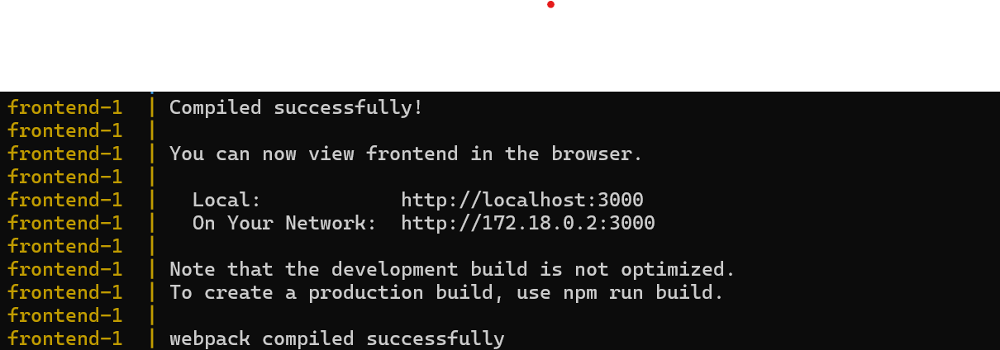

# Task Manager Web Application

This is a simple task manager web application with a Django REST backend and a ReactJS frontend. The application can be run using Docker or by setting up the backend and frontend environments manually.

## Project Structure

The root folder `task-manager` contains the two project folders `backend` and `frontend` as well as `.gitignore` `docker-compose.yml` and this `README.md`.

The `backend` folder is the main Django REST API project and contains a single application `tasks`. This folder also contains the project packages in `requirements.txt` and Docker configuration file.

The `frontend` folder is the React App created using `npx create-react-app frontend`. It contains all the frontend code including Docker configuration file.

```
task-manager/
│
├── backend/
│ ├── backend/
│ ├── tasks/
│ ├── manage.py
│ ├── requirements.txt
│ ├── Dockerfile
│ └── ...
│
├── frontend/
│ ├── src/
│ ├── public/
│ ├── Dockerfile
│ ├── package.json
│ └── ...
│
├── .gitignore
├── docker-compose.yml
└── README.md
```

## Project Setup Instructions

There are two options for running this project:

1. Using Docker
2. Manual Setup

### Using Docker

1. Clone the repo

```bash
git clone git@github.com:CaptainMumo/task-manager.git
```

2. Ensure you have [Docker](https://www.docker.com/get-started) and [docker-compose](https://docs.docker.com/compose/install/) installed and running on your machine.

3. Navigate to the root folder of the project:

```bash
cd path/to/task-manager
```

4. Build and start the application using Docker Compose:

```bash
docker-compose up --build
```

5. Above step takes a while to setup the images and run the servers. Be patient until you see the following!



6. The application should now be running and accessible at (http://localhost:3000)

7. In case of any issues, you can follow the manual setup instead.

### Manual Setup

Clone the repo

```bash
git clone git@github.com:CaptainMumo/task-manager.git
```

#### Backend Setup

1. Ensure you have [Python](https://www.python.org/) version 3.12 installed.

2. Navigate to the root folder of the project:

   ```bash
   cd path/to/task-manager
   ```

3. Create and activate a virtual environment in the `backend` folder:

```bash
cd backend
python -m venv venv
source venv/bin/activate # On Windows use `venv/Scripts/activate`
```

4. Install the backend dependencies:

```bash
pip install -r requirements.txt
```

5. Run database migrations:

```bash
python manage.py migrate
```

6. Start the Django development server:

```bash
python manage.py runserver
```

The backend will running at (http://localhost:8000)

7. To run the backend unit tests:

```bash
python manage.py test
```

#### Frontend Setup

1. Ensure you have [Node.js](https://nodejs.org/) version 20.16.0 installed.

2. Navigate to the `frontend` folder:

```bash
cd frontend
```

3. Install the frontend dependencies:

```bash
npm install
```

4. Start the React development server:

```bash
npm start
```

5. Go to (http://localhost:3000) to interact with the application. 

### Interacting with the application

1. Create a user account.
2. Add several tasks through both 'Add Task' buttons.
3. Manage your tasks on the homepage (mark as complete, mark as incomplete, edit, delete)
4. Click on a task to view more details i.e. description
5. Interact with a task on the task detail page (mark as complete, mark as incomplete, edit, delete)
6. Have fun! ..then logout

## Video Demo
The following is a short video demonstrating how to use the application.

[Click here to watch on Loom](https://www.loom.com/share/d43e8fc5cc6e42089406b8e75d94f24c?sid=b237b1db-023b-4008-9c8a-80da6a07ec84)

<iframe src="https://www.loom.com/embed/d43e8fc5cc6e42089406b8e75d94f24c?sid=a7901547-2095-41dc-8e83-9fd5e6be0781" frameborder="0" webkitallowfullscreen mozallowfullscreen allowfullscreen></iframe>

### Contact Me
Feel free to reach out to me via mumopeter17@gmail.com in case of any issues.
